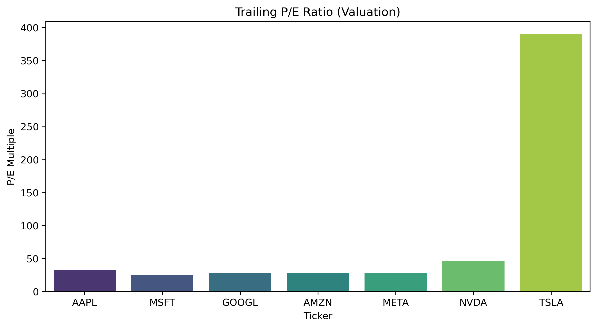
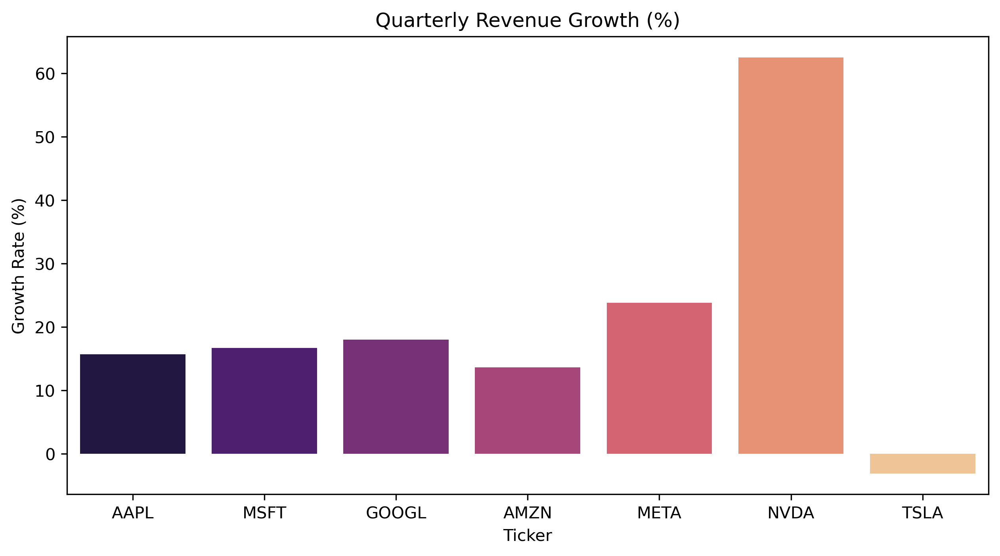

# Motivation and Purpose

## Target Audience:
Our target audience is individual investors who manage their own stock portfolios and want a better way to track how their investments are doing. We are building this dashboard as a helpful financial tool that makes stock information easier to understand and keep track of in one place. 

## Problem:
Many investors are busy and do not have time to check their accounts every day. They also do not want to go through each stock one by one to see how it is performing. Financial information is often spread across different websites, which makes it harder to get a clear picture of their portfolio.

It can be confusing and time-consuming to track both daily price changes and long-term performance since the day they bought the stock. Because of this, investors may find it difficult to make quick and confident decisions.

## Solution: 
Our dashboard is designed to be a one-stop place where investors can see everything clearly. It includes summary tables and interactive charts so users can easily view both short-term and long-term performance.

Users can see daily price changes, total performance since purchase, current market value, and basic risk information. We also include a watchlist section so they can follow stocks they are interested in.

By putting all this information together in a simple and visual way, the dashboard helps investors understand their portfolio faster and make better decisions with less effort.

# Description of the Data

The data we will use for our dashboard includes historical stock price data, financial metrics, and market information for the Magnificent 7 stocks (Apple, Microsoft, Amazon, Alphabet, Meta, Nvidia, and Tesla). We will source this data from Yahoo Finance, which provides comprehensive historical data on stock prices, trading volumes, and key financial indicators. We will include benchmark data for the S&P 500 to allow users to compare their portfolio performance against the broader market, and finally, we will also include data covering market cap, P/E ratios, Dividend yield and revenue growth.

Our primary dataset will consist of daily close stock prices for the magnificent 7 stocks. This dataset contains 7 columns (one for each stock) and approximately 2541 rows, covering the past 10 years of trading data. Each row represents a trading day, and the columns represent the closing price of each stock on that day. This data will allow us to analyze price trends, calculate returns, and visualize performance over time.

Our metrics dataset (containing market cap, P/E ratios, dividend yield, and revenue growth) contains 6 columns, and 7 rows of data. This will be combined with the price data to provide a comprehensive view of each stock's performance.

The data on the S&P 500 will also include daily closing prices for the same time period, containing 2516 rows,allowing us to calculate the overall performance of the benchmark and compare it to the performance of the Magnificent 7 stocks.

Finally, we will also include a watchlist dataset that contains the closing price for additional stocks that users may want to monitor. This dataset contains 2515 rows and columns comprising stocks AMD, MU, NFLX. 

# Research Questions & Usage Scenarios

- **Persona - Daniel Chen**
Daniel is a data-driven retail investor working as tech professional, specifically as a data science instructor for MDS, he is an intermediate retail trader with goals of comparing top tech stocks efficiently and making informed long-term investment decisions. He struggles to consolidate information as financial data is scattered across multiple websites and hes overwhelmed by raw financial statements. He has been losing consistently and wants to trace where he went wrong.

## Usage scenario
Daniel is reviewing his investment portfolio after noticing that most of his holdings are concentrated in large-cap tech stocks. He wants to better understand how the Magnificent 7 stocks compare across valuation, profitability, and performance metrics. Instead of checking multiple financial websites, Daniel opens the dashboard. He filters the time range to the past 3 years and examines price performance trends, P/E ratios and revenue growth, market cap comparison, and volatility metrics. The dashboard enables him to make a data-backed decision in minutes instead of hours.

- **User Stories / Jobs To Be Done (JTBD)**
User story 1 – Performance Comparison: As an investor and I want to compare historical stock performance across the Magnificent 7, so that I can identify which companies are leading or lagging over a selected time period, and also compare these stocks to the S&P 500 so I can understand how top tech stocks compare.

User Story 2 – Valuation Analysis: As a valuation-focused trader, I want to compare key metrics of booming tech stocks, specfically metrics such as P/E ratio, earnings growth, and revenue growth side-by-side, so that I can assess whether a stock appears overvalued or undervalued relative to the market and to other similar tech stocks.

User story 3 - Reporting: As a banker, I want to display charts and graphs to the bank customers looking for investing help. These visuals should be able to display numerical information and be interpretable by the layman. I want to show them how the magnificent 7's ROI and risk compare to my bank's ETFs and other securities.

# 4. Exploratory Data Analysis

User Story 2 – Valuation Analysis. 

These graphs aid in decision making as it reveals information about valuation vs. profit and also about business activity and growth. Trailing P/E is the current share price divided by earnings per share over the last 12 months. It indicates how many dollars investors pay for each dollar of past earnings (e.g., P/E 20 = paying 20 times last year’s earnings). It also shows market expectations, as high trailing P/E can mean the market expects strong future growth, or that the stock is overvalued, in the graph, Tesla has a much higher P/E than others. The other graph shows quartly revenue growth, it is the sales the company generates in a three‑month period, and quarterly revenue growth is the percentage change versus a prior quarter or the same quarter last year. It indicates business activity and demand rising revenue usually means more customers, higher volumes, or better pricing; falling revenue can signal weakening demand or competitive pressure. As well as growth momentum, as consistent positive quarterly revenue growth points to expanding operations and can support a higher valuation; volatile or negative growth raises questions about sustainability, which can indicate a lot given how high Nvidia is compared to other stocks in this graph. The trader can make a decision based on their risk tolerance and investment strategies.

# 5. App Sketch & Description

The sketch above shows the overall layout of our dashboard.

### Portfolio Holdings (Top Left)
Displays summary cards for each stock, including ticker, latest price, and daily return. Users can click a card to update the stock price chart.

### Stock Price Chart (Top Center)
Shows the selected stock’s price trend over a selected time period. This allows users to quickly analyze short-term and long-term movements.

### Risk vs Return (Top Right)
A scatter plot comparing annual return (y-axis) and volatility (x-axis) across the selected stocks. This helps users evaluate performance relative to risk.

### Performance Comparison (Middle Left)
A multi-line chart comparing price trends of the Magnificent 7 stocks over a selected time period.

### Portfolio vs S&P 500 (Middle Center)
A line chart comparing overall portfolio performance against a benchmark (S&P 500).

### Returns Heatmap (Middle Right)
A treemap visualization showing daily returns of the Magnificent 7 stocks. Each rectangle represents a stock, where the size of the box reflects its portfolio weight (or market value), and the color indicates its daily return (green for gains, red for losses).

### Risk & Valuation Metrics (Bottom Left)
A summary table displaying key financial metrics such as P/E ratio, revenue growth, annual return, and volatility for side-by-side comparison.

### Watchlist (Bottom Right)
A simple list of additional stocks the user is monitoring, showing latest prices and basic indicators.